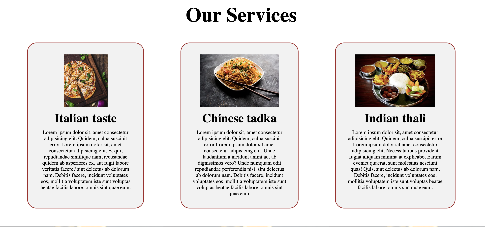
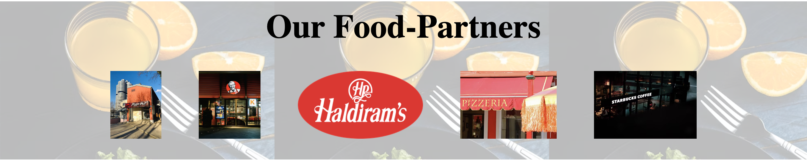

  <h1>🍽️ I-Hungry</h1>
  <a href="https://i-hungry.netlify.app/"><strong>🔗 Live Demo</strong></a>

<h2 align="center">
  👨‍💻 ✨ 🍜 🔥 🥗 📱 💡 🍕 🚀
</h2>

## 📌 Overview

**I-Hungry** is a minimalist web application designed to surprise users with random meal recipes.  
Built using HTML and CSS, it offers a straightforward interface where users can discover new dishes with a single click.

## 🚀 Features

- 🎲 **Random Recipe Generator**: Fetches a random meal recipe each time the page is loaded or refreshed.
- 🎨 **Clean UI Design**: Emphasizes simplicity and user-friendliness.
- 🌐 **Responsive Layout**: Ensures compatibility across various devices and screen sizes.

## 🛠️ Technologies Used

- **HTML5**
- **CSS3**

## 📸 Screenshots

  
  
  
  

## 📂 Repository

Explore the source code on GitHub: [iNitishSheoran/food_web](https://github.com/iNitishSheoran/food_web)
